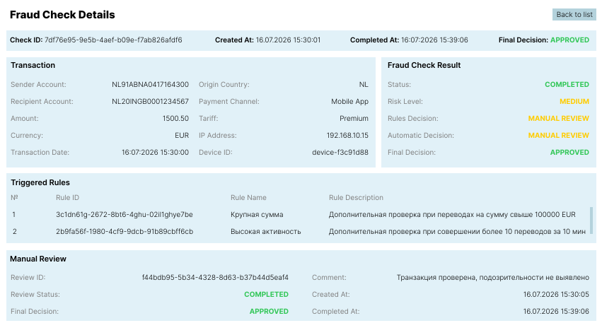

# UI-интерфейс просмотра результатов антифрод-проверки

## 1. Назначение
Экран предназначен для просмотра результатов антифрод-проверки банковской транзакции. Пользователь может просмотреть сведения о транзакции, результаты автоматической проверки, список сработавших антифрод-правил и информацию о ручной проверке (при ее наличии).

## 2. Макет интерфейса

## 3. Описание элементов интерфейса
|Элемент|Назначение|
|-|-|
|Fraud Check Details|Отображение общей информации о проверке|
|Transaction|Отображение параметров проверяемой транзакции|
|Fraud Check Result|Отображение результатов автоматической антифрод-проверки|
|Triggered Rules|Отображение списка антифрод-правил, сработавших при проверке|
|Manual Review|Отображение результатов ручной проверки при ее наличии|
|Back to list|Возврат к списку антифрод-проверок|

## 4. Маппинг полей UI
|Поле UI|Источник|
|-|-|
|Check ID|FraudCheck.check_id|
|Created At|FraudCheck.created_at|
|Completed At|FraudCheck.completed_at|
|Final Decision|FraudCheck.final_decision|
|Sender Account|Transaction.sender_account|
|Recipient Account|Transaction.recipient_account|
|Amount|Transaction.amount|
|Currency|Transaction.currency|
|Transaction Date|Transaction.transaction_date|
|Origin Country|Transaction.origin_country|
|Payment Channel|Transaction.payment_channel|
|Tariff|Transaction.tariff|
|IP Address|Transaction.ip_address|
|Device ID|Transaction.device_id|
|Status|FraudCheck.status|
|Risk Level|FraudCheck.risk_level|
|Rules Desicion|FraudCheck.rules_decision|
|Automatic Decision|FraudCheck.automatic_decision|
|FinalDecision|FraudCheck.final_decision|
|Rule ID|FraudRule.rule_id|
|Rule Name|FraudRule.rule_name|
|Rule Description|FraudRule.rule_description|
|Review ID|ManualReview.manual_review|
|Review Status|ManualReview.mr_status|
|Comment|ManualReview.comment|
|Final Decision|ManualReview.final_decision|
|Created At|ManualReview.created_at|
|Completed At|ManualReview.completed_at|

## 5. Справочники
На данном экране справочники не используются, так как экран предназначен исключительно для просмотра результатов проверки.

Справочники (Currency, Origin Country, Payment Channel, Tariff) используются на этапе создания заявки на антифрод-проверку банковской системой и уже отображаются в виде готовых значений.

## 6. Правила отображения
|Элемент|Правило отображения|
|-|-|
|Fraud Check Details|Отображается всегда|
|Transaction|Отображается всегда|
|Fraud Check Result|Отображается всегда|
|Triggered Rules|Отображается всегда. При отсутствии сработавших правил отображается сообщение «Нет сработавших правил»|
|Manual Review|Отображается только при наличии объекта manual_review|

## 7. Валидация
Экран является экраном просмотра результатов проверки и не предусматривает ввод или изменение данных пользователем.

Валидация пользовательского ввода отсутствует.

При отображении данных выполняются следующие проверки:
|Поле|Проверка|
|-|-|
|Дата и время|Отображается в формате dd.MM.yyyy HH:mm:ss|
|Amount|Отображается с двумя знаками после запятой|
|Currency|Отображается трехбуквенный код валюты|
|Origin Country|Отображается двухбуквенный код страны|
|Статусы и решения|Отображаются только значения, предусмотренные системой|

## 8. Позитивные сценарии
Сценарий 1: просмотр завершенной проверки

Предусловие: антифрод-проверка завершена.

1. Пользователь открывает карточку проверки.
2. Система загружает данные проверки.
3. Отображаются сведения о транзакции.
4. Отображаются результаты автоматической проверки.
5. Отображается список правил.
6. При наличии отображается блок ручной проверки.

Сценарий 2: просмотр проверки без ручной проверки

Предусловие: проверка завершена автоматически.

1. Пользователь открывает карточку проверки.
2. Отображаются результаты автоматической проверки.
3. Блок Manual Review не отображается.

## 9. Негативные сценарии
|Сценарий|Поведение системы|
|-|-|
|Проверка не найдена|Отображается сообщение «Проверка не найдена»|
|Ошибка получения данных|Отображается сообщение «Не удалось загрузить данные антифрод-проверки»|
|Ошибка получения списка правил|Отображается сообщение «Не удалось загрузить сработавшие правила»|
|Ошибка получения данных ручной проверки|Отображается сообщение «Не удалось загрузить данные ручной проверки»|

## 10. Особенности реализации
* экран предназначен только для просмотра результатов проверки
* изменение данных пользователем не предусмотрено
* все сведения отображаются в режиме read-only
* информация о ручной проверке отображается только при наличии соответствующего объекта в составе документа FraudCheck
* навигация к экрану осуществляется из списка антифрод-проверок