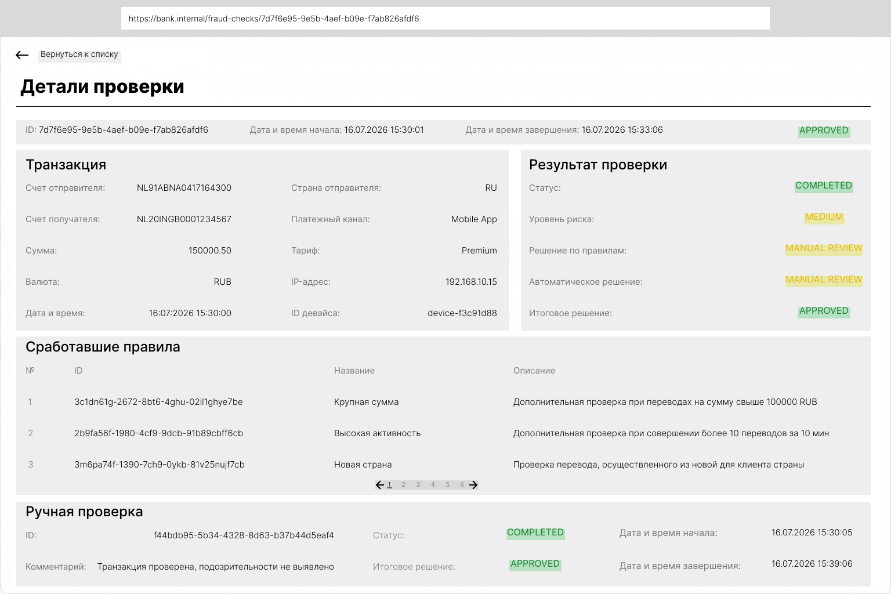
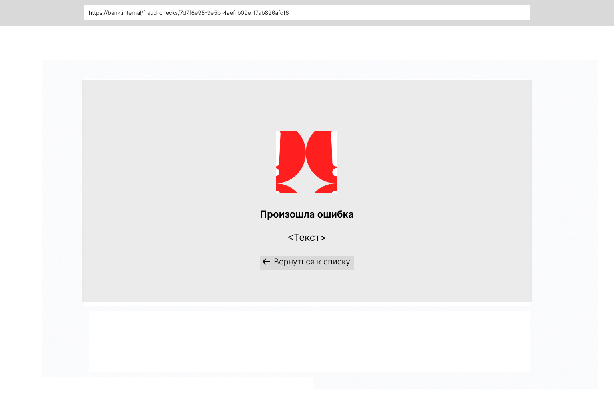

# UI-интерфейс просмотра результатов антифрод-проверки

## 1. Назначение
Экран предназначен для просмотра результатов антифрод-проверки банковской транзакции. Пользователь может просмотреть сведения о транзакции, результаты автоматической проверки, список сработавших антифрод-правил и информацию о ручной проверке (при ее наличии).

## 2. Макеты интерфейса

#### Экран просмотра проверки

*Открытие карточки*

1) пользователь нажимает на карточку проверки;
2) UI выполняет запрос GET /fraud-checks/{checkId};
3) UI отображает карточку с деталями проверки.

*Переход на другую страницу списка сработавших правил*

1) пользователь нажимает кнопку пагинации;
2) UI выполняет запрос GET /fraud-checks/{checkId}?rulesPage={rulesPage}&rulesSize={rulesSize};
3) UI отображает выбранную страницу списка сработавших правил;
4) остальная информация карточки проверки не меняется.

*Возврат к списку*

1) пользователь нажимает кнопку "Вернуться к списку";
2) UI выполняет запрос GET /fraud-checks?page={page}&size={size}&status={status}&finalDecision={finalDecision};
3) UI отображает список проверок с сохранением параметров, которые были указаны до открытия карточки.

#### Экран списка проверок

*Открытие страницы*

1) пользователь открывает страницу списка проверок;
2) UI выполняет запрос GET /fraud-checks?page=1&size=10;
3) UI отображает список проверок.

*Применение фильтров*

1) пользователь нажимает на поле "Статус проверки" или "Итоговое решение";
2) UI отображает выпадающий список значений соответствующего справочника;
3) пользователь выбирает одно значение из списка;
4) выбранное значение отображается в соответствующем поле;
5) пользователь нажимает кнопку "Применить";
6) UI выполняет запрос GET /fraud-checks?page=1&size=10&status={status}&finalDecision={finalDecision};
7) UI отображает список проверок в соответствии с выбранными фильтрами.

*Очистка фильтров*

1) Пользователь нажимает кнопку "Очистить";
2) UI сбрасывает значения фильтров;
3) Выполняется запрос GET /fraud-checks?page=1&size=10;
4) отображается полный список.

*Переход на другую страницу*

1) пользователь нажимает кнопку пагинации;
2) UI выполняет запрос GET /fraud-checks?page={page}&size={size};
3) отображается следующая страница списка.

#### Экран ошибки

*Поведение интерфейса*

1) UI получает ответ API с кодом, отличным от успешного;
2) отображается экран ошибки;
3) текст берется из поля message;
4) при нажатии кнопки "Вернуться к списку" UI выполняет запрос GET /fraud-checks?page={page}&size={size}&status={status}&finalDecision={finalDecision} и отображает список проверок с сохранением пагинации и фильтров.

## 3. Описание элементов интерфейса
|Элемент|Назначение|
|-|-|
|Детали проверки|Отображение общей информации о проверке|
|Транзакция|Отображение параметров проверяемой транзакции|
|Результат проверки|Отображение результатов антифрод-проверки|
|Сработавшие правила|Отображение списка антифрод-правил, сработавших при проверке|
|Ручная проверка|Отображение результатов ручной проверки при ее наличии|
|Вернуться к списку|Возврат к списку антифрод-проверок|

## 4. Маппинг полей UI
|Поле UI|Источник|Валидация|
|-|-|-|
|ID|check_id|Обязательное, UUID|
|Дата и время начала|created_at|Обязательное, ISO 8601|
|Дата и время завершения|completed_at|Обязательное, ISO 8601|
|Итоговое решение|final_decision|Обязательное, APPROVED/REJECTED|
|Счет отправителя|transaction.sender_account|Обязательное|
|Счет получателя|transaction.recipient_account|Обязательное|
|Сумма|transaction.amount|Обязательное, >0|
|Валюта|transaction.currency|Обязательное, RUB/USD/EUR|
|Дата и время|transaction.transaction_date|Обязательное, ISO 8601|
|Страна отправителя|transaction.origin_country|Обязательное, ISO 3166-1 Alpha-2|
|Платежный канал|transaction.payment_channel|Обязательное|
|Тариф|transaction.tariff|Обязательное|
|IP-адрес|transaction.ip_address|Обязательное, IPv4|
|ID девайса|transaction.device_id|Обязательное|
|Статус|status|Обязательное, PENDING/IN_PROGRESS/COMPLETED/CANCELLED/FAILED|
|Уровень риска|risk_level|Обязательное, LOW/MEDIUM/HIGH|
|Решение по правилам|rules_decision|Обязательное, APPROVED/REJECTED/MANUAL_REVIEW|
|Автоматическое решение|automatic_decision|Обязательное, APPROVED/REJECTED/MANUAL_REVIEW|
|Итоговое решение|final_decision|Обязательное, APPROVED/REJECTED|
|ID|fraud_rules[].rule_id|Обязательное (если массив не пустой), UUID|
|Название|fraud_rules[].rule_name|Обязательное (если массив не пустой)|
|Описание|fraud_rules[].rule_description|Обязательное (если массив не пустой)|
|ID|manual_review.review_id|Обязательное при наличии manual_review, UUID|
|Статус|manual_review.mr_status|Обязательное при наличии manual_review, IN_PROGRESS/COMPLETED|
|Комментарий|manual_review.comment|Необязательное|
|Итоговое решение|manual_review.final_decision|Обязательное при наличии manual_review, APPROVED/REJECTED|
|Дата и время начала|manual_review.created_at|Обязательное при наличии manual_review, ISO 8601|
|Дата и время завершения|manual_review.completed_at|Обязательное при наличии manual_review, ISO 8601|

## 5. Справочники

**Статус проверки**
|Значение|Отображение в UI|Описание|
|-|-|-|
|PENDING|PENDING|Проверка создана и ожидает начала обработки|
|IN_PROGRESS|IN PROGRESS|Проверка выполняется|
|COMPLETED|COMPLETED|Проверка успешно завершена|
|CANCELLED|CANCELLED|Проверка отменена|
|FAILED|FAILED|Во время выполнения проверки произошла ошибка|

**Итоговое решение**
|Значение|Отображение в UI|Описание|
|-|-|-|
|APPROVED|APPROVED|Транзакция признана безопасной и одобрена|
|REJECTED|REJECTED|Транзакция признана мошеннической и отклонена|