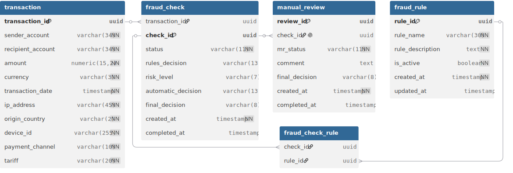
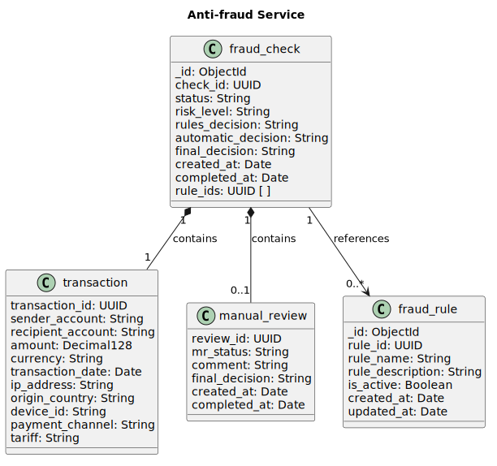

# Концептуальная модель данных в нотации Чена

# Логическая/физическая модель данных в нотации Мартина

## Табличная часть

#### Сущность transaction
|Атрибут|Тип данных|Ограничения|Описание|
|-|-|-|-|
|transaction_id|UUID|PK|Уникальный идентификатор транзакции|
|sender_account|VARCHAR (34)|NOT NuUll|Номер счета отправителя|
|recipient_account|VARCHAR (34)|NOT NUll|Номер счета получателя|
|amount|NUMERIC (15,2)|NOT NULL, CHECK (amount > 0)|Сумма перевода|
|currency|VARCHAR (3)|CHECK (LENGTH (currency) = 3), NOT NULL|Валюта|
|transaction_date|TIMESTAMP|NOT NULL|Дата и время инициации транзакции|
|ip_address|VARCHAR (45)|NOT NULL|IP-адрес клиента|
|origin_country|VARCHAR (2)|CHECK (LENGTH (origin_country) = 2), NOT NULL|Код страны, из которой была инициирована транзакция|
|device_id|VARCHAR (255)| NOT NULL|Уникальный идентификатор девайса, с которого инициирована транзакция|
|payment_channel|VARCHAR (10)|NOT NULL, CHECK (payment_channel IN ('MOBILE_APP', 'WEB'))|Канал, через который была инициирована транзакция|
|tariff|VARCHAR (20)|NOT NULL|Тарифный план клиента|

#### Сущность fraud_check
|Атрибут|Тип данных|Ограничения|Описание|
|-|-|-|-|
|transaction_id|UUID|FK|Уникальный идентификатор транзакции|
|check_id|UUID|PK|Уникальный идентификатор антифрод-проверки|
|status|VARCHAR (11)|NOT NULL, CHECK (status IN ('PENDING', 'IN_PROGRESS', 'COMPLETED', 'CANCELLED', 'FAILED'))|Текущий статус проверки|
|rules_decision|VARCHAR (13)|CHECK (rules_desicion IN ('APPROVED', 'REJECTED', 'MANUAL_REVIEW'))|Решение, принятое по итогам проверки по антифрод-правилам|
|risk_level|VARCHAR (7)|CHECK (risk_level IN ('LOW', 'MEDIUM', 'HIGH', 'UNKNOWN'))|Уровень риска, полученный от AI Risk Scoring Service|
|automatic_decision|VARCHAR (13)|CHECK (automatic_decision IN ('APPROVED', 'REJECTED','MANUAL_REVIEW'))|Автоматическое решение, принятое по матрице принятия решения|
|final_decision|VARCHAR (8)|CHECK (final_decision IN ('APPROVED', 'REJECTED'))|Финальное решение по операции|
|created_at|TIMESTAMP|NOT NULL|Дата и время начала проверки|
|completed_at|TIMESTAMP|CHECK (completed_at > created_at)|Дата и время окончания проверки|

#### Сущность manual_review
|Атрибут|Тип данных|Ограничения|Описание|
|-|-|-|-|
|review_id|UUID|PK|Уникальный идентификатор ручной проверки|
|check_id|UUID|FK|Уникальный идентификатор антифрод-проверки|
|mr_status|VARCHAR (11)| CHECK (mr_status IN ('IN_PROGRESS', 'COMPLETED')), NOT NULL|Текущий статус ручной проверки|
|comment|TEXT|-|Комментарий антифрод-аналитика|
|final_decision|VARCHAR (8)| CHECK (final_decision IN ('APPROVED', 'REJECTED'))|Финальное решение по операции|
|created_at|TIMESTAMP|NOT NULL|Дата и время создания ручной проверки|
|completed_at|TIMESTAMP|CHECK (completed_at > created_at)|Дата и время окончания ручной проверки|

#### Сущность fraud_rule
|Атрибут|Тип данных|Ограничения|Описание|
|-|-|-|-|
|rule_id|UUID|PK|Уникальный идентификатор антифрод-правила|
|rule_name|VARCHAR (30)|NOT NULL|Название антифрод-правила|
|rule_description|TEXT|NOT NULL|Описание антифрод-правила|
|is_active|BOOLEAN|NOT NULL|Индикатор активности правила|
|created_at|TIMESTAMP|NOT NULL|Дата и время создания антифрод-правила|
|updated_at|TIMESTAMP|CHECK (updated_at > created_at)|Дата и время последнего обновления антифрод-правила|

#### Связующая таблица fraud_check_rule
|Атрибут|Тип данных|Ограничения|Описание|
|-|-|-|-|
|check_id|UUID|PK, FK|Ссылка на антифрод-проверку|
|rule_id|UUID|PK, FK|Ссылка на антифрод-правило|

# Class Diagram MongoDB

# JSON-объект
[JSONobject](JSONobject.json)

# JSON Schema
[JSONschema2](JSONschema2.json)

# DDL-скрипты
[DDL](postgresql_ddl.sql)

# DML-скрипты
[DML](postgresql_dml.sql) 

**Описание значимости артефакта**
|Раздел|Содержание|
|-|-|
|Процесс и контекст использования|Используется на этапе проектирования системы для разработки структуры хранения данных в PostgreSQL и MongoDB|
|Цель создания|Определить структуру данных, связи между сущностями и правила их хранения|
|Что становится определено|Состав сущностей, атрибутов, связей, ограничений целостности и структуры документов MongoDB|
|Пользователи артефакта|Системный аналитик, разработчики, DBA. Используют для реализации и сопровождения базы данных|
|Использование в дальнейшем|На основе модели создается база данных, реализуются запросы, API и бизнес-логика сервиса|
|Последствия отсутствия|Возможны ошибки при проектировании БД, несогласованность данных и увеличение времени разработки|
